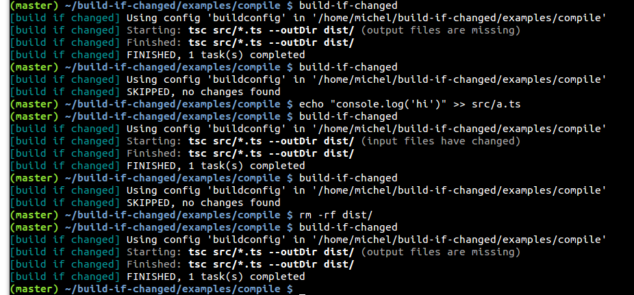

# build-if-changed

Minimal build system for maximal efficiency

## Why `build-if-changed`?

`build-if-changed` is like a portable version of `make` but way more simple.
given a bunch of file patterns it executes a command if (and only if) any of the files inside the patterns did change.
A simple pattern that allows for powerful composition for dependent build tasks.

## Installation

`npm install -g build-if-changed`

## General usage

Run `build-if-changed` in any directory. It will search in the current directory or upwards for a file named `buildconfig`.

A build config file looks like this:

```
[some command]
glob pattern1 to watch
glob pattern2 to watch

[another command]
more patterns to watch
```

`build-if-changed` will calculate the hashes of all files that match the patterns,
and execute the matching command(s) if the files did change since the previous run of `build-if-changed`.
It is perfectly fine if the output of one command is watched by another command, `build-if-changed` will keep trying to run commands until no files change anymore.  

Glob patterns and patterns are always interpreted relatively to the location of the `buildconfig` file.

Also see the [examples](examples/) directory for some examples.

This is what using `build-if-changed` looks like:


## Command usage

Command syntax is: `build-if-changed [--watch] [-c directory] [--clean] [file1] [file2]

#### --watch

(TODO)
Same as `build-if-changed`, but, as suggested, will keep watching the files for any future changes.
The watch will continue to run even if some commands did fail.

#### -c directory

(TODO)
Run's `build-if-changed` in the specified directory, searching for a `buildconfig` file in that directory and upward.

#### file1 file2 ...

(TODO)
Reads configuration from the specified configuration file(s).
Note that the configuration files are still interpreted relatively to their own location. 

#### --clean

(TODO)
Drops the `.buildifchanged` directory and thereby forcing all commands to run upon the next invocation of `build-if-changed`.

## Questions

**Q: What is this magically appearing `.buildifchanged` folder?**

A:File hashes as stored in the folder `.buildifchanged` in the same directory as the `buildconfig` file. This file should be excluded from version control.

**Q: Does the order of commands matter?**

A: Yes. It doesn't matter for the buid result, but it does matter for performance. If command A produces input for command B, A should be defined before B.
Otherwise the system might run the commands B, A, B instead of just A, B.

**Q: Why can a build command be only one line?**

A: Separation of concerns;
build-if-changed only determines when your build tools should be run. 
Complex commands should be organized outside build-if-changed so that you can test, version and invoke them manually.
Use any tool you are comfortable with to organize your build scripts, `sh`, `npm`, `gulp`, `webpack`....  